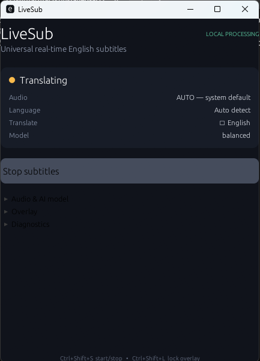
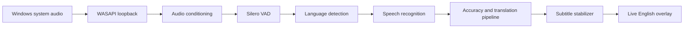
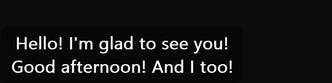

# LiveSub

**Accuracy-first live English subtitles for audio playing on your Windows PC.**

[Windows releases](https://github.com/dashqqq/LiveSub/releases) · [Installation](docs/installation.md) · [Report a problem](https://github.com/dashqqq/LiveSub/issues)

**Preview** — core live translation works, while accuracy certification, production signing, and release licensing review are still in progress.

LiveSub listens to Windows system audio, detects supported spoken languages, and displays English subtitles in a floating overlay. It works independently of the site or player, so it can subtitle YouTube, Twitch, Kick, VLC, browser video, games, Discord, and other Windows applications without relying on platform captions.

## Download

The official Windows installer will be distributed through [GitHub Releases](https://github.com/dashqqq/LiveSub/releases). Look for the **LiveSub Preview** pre-release and its `LiveSub-Setup.exe` asset.

> **Release notice:** the current Preview installer is unsigned and is not yet publicly posted while installer and bundled-component redistribution review is completed. When it is published, Windows SmartScreen may show an “Unknown publisher” warning. Code signing is planned before a stable release. Never disable Windows security to install LiveSub.

The installer is designed to include the application, private inference runtime, default speech model, and required native libraries. End users should not need to install Python, Node.js, Rust, FFmpeg, the CUDA Toolkit, or development tools manually.

## What is LiveSub?

LiveSub is a Windows desktop application for people who want to understand foreign-language media as it plays. It captures the default Windows output with WASAPI loopback—no microphone, browser extension, or media-platform integration is required for normal system-audio translation.

Many videos, livestreams, games, and voice communities have no captions, incomplete captions, or no useful English translation. LiveSub operates at the audio layer, making one subtitle experience available across applications.

## How it works

Capture, recognition, translation, and display are separated by bounded queues. Slow inference cannot silently build an unlimited backlog, and overlapping recognition windows are reconciled before final subtitles are shown. See the [architecture guide](docs/architecture.md) for the technical design.

## Supported languages

| Source language | Output | Current status |
| --- | --- | --- |
| Russian | English | Preview |
| Japanese | English | Preview |
| Hindi | English | Preview |
| English | English captions | Supported |

Automatic language detection accumulates evidence and holds a stable language instead of switching on every short audio fragment. Russian, Japanese, and Hindi are the first-class accuracy targets; their public human-reviewed certification is not complete.

## Features

- Windows system-audio capture with no microphone required
- Native, always-on-top subtitle overlay with lock/click-through behavior
- Automatic language detection for the default language set
- Tentative and confirmed subtitle handling with overlap deduplication
- Source-language final transcription and optional bilingual display
- Terminology preservation, session glossary, translation memory, and semantic checks
- Hallucination, repetition, no-speech, and low-confidence defenses
- Local inference with compatible NVIDIA GPU acceleration and CPU fallback
- Automatic default-output recovery and visible queue/runtime diagnostics
- Self-contained per-user Windows installer design

## Accuracy first

LiveSub is being engineered around a simple principle: a language should earn support through testing. It is not presented as perfect, zero-latency, or supported by an unverified accuracy percentage.

The evaluation framework tracks speech-recognition error, translation quality, proper nouns, numbers, negation, directions, terminology, code switching, noise robustness, hallucinations, stability, real-time factor, and subtitle latency. Candidate ASR and translation routes can be compared per language rather than forcing every language through one model.

The current build contains many of these runtime safeguards, but the human-reviewed Russian, Japanese, and Hindi benchmark campaign remains a release gate. Read [how accuracy is evaluated](docs/accuracy.md) and the [current verification record](docs/accuracy-verification-20260822.md).

## Privacy

Normal live translation is local. Audio is captured from the selected Windows output, processed in bounded memory, and is not written to disk by the runtime. Subtitle history is session memory only. LiveSub has no cloud translation provider or telemetry integration in the current build.

Internet access is used by explicit developer/model-staging tools to retrieve models; normal packaged translation does not implicitly download a model. Future model downloads, update checks, or optional online providers must be disclosed separately and must not upload raw audio by default.

See the full [privacy notes](docs/privacy.md).

## System requirements

- Windows 10 or Windows 11, 64-bit
- A working Windows audio output device
- Approximately 1.47 GB for the current installer and 2.67 GiB for the measured installed payload
- A compatible NVIDIA GPU is recommended for faster inference
- CPU fallback is supported with reduced throughput
- Internet access is not required for normal translation after the self-contained Preview installer is installed

Minimum and recommended RAM, broader GPU/driver compatibility, and sustained CPU performance are still being validated. LiveSub does not install display drivers.

## Installation

1. Open [Releases](https://github.com/dashqqq/LiveSub/releases).
2. Choose the latest **LiveSub Preview** pre-release.
3. Download `LiveSub-Setup.exe` and its `.sha256` file.
4. Verify the checksum, then run the installer.
5. Launch **LiveSub** from the Start menu.

Public installer publication is currently pending the release review described above. Detailed steps and checksum instructions are in [docs/installation.md](docs/installation.md).

## How to use

1. Launch LiveSub.
2. Press **Start live subtitles**.
3. Play supported foreign-language audio in any Windows application.
4. Wait for speech and language detection.
5. Unlock and position the subtitle overlay if needed.
6. Lock the overlay to make it click-through while watching.

English subtitles are the default. Enable **Show source language above English** for bilingual subtitles.

### Overlay controls

- `Ctrl+Shift+S`: start or stop subtitles
- `Ctrl+Shift+H`: show or hide the overlay
- `Ctrl+Shift+Up` / `Ctrl+Shift+Down`: change subtitle size
- `Ctrl+Shift+L`: lock or unlock click-through

The native overlay is transparent, always on top, draggable while unlocked, and non-activating so it does not steal focus. Exclusive fullscreen, secure desktops, protected surfaces, and some anti-cheat environments can prevent normal Windows overlay composition.

## Language Packs

LiveSub is being designed around installable, validated **Language Packs**. A future pack will specify a pinned ASR route, translation route, VAD/LID settings, model provenance, licenses, integrity hashes, hardware profiles, and benchmark results.

The Language Library and consumer installation flow are not released yet. The repository contains registry schemas and pinned candidate manifests for engineering work; their presence does not mean every candidate is shipped or production-approved. See [language support](docs/language-support.md).

## Preview limitations

- Human-reviewed WER/CER and translation-quality certification is incomplete.
- Hindi and Hinglish require broader real-world validation.
- Per-language production routes have not yet been selected from the full benchmark matrix.
- The consumer Language Library, fourth-language installation proof, signed registry, and rollback flow are incomplete.
- Thirty-minute per-language soak tests and repository-absent clean-machine certification remain open.
- The installer is unsigned, and public redistribution review for installer tooling and bundled components is unresolved.
- Hardware guidance beyond the tested development machine is still being expanded.

This engineering verdict remains **ACCURACY-FIRST RELEASE: NOT READY**. “Preview” describes functional software under evaluation, not a stable or certified release.

## Roadmap

**Available in the current engineering build**

- Windows WASAPI system-audio capture
- Russian, Japanese, Hindi, and English processing paths
- Stable native subtitle overlay
- Local packaged inference with GPU acceleration and CPU fallback
- Benchmark harness, accuracy guards, and language-pack schemas

**Next**

- Complete human-reviewed golden corpora and per-language model selection
- Finish Hindi/Hinglish and noisy real-stream acceptance testing
- Prove a fourth-language install, update, and rollback end to end
- Complete redistribution/licensing review and code-sign the installer
- Complete long-run and repository-absent clean-machine certification

**Later**

- Curated Language Library with additional validated languages
- Separate application and model updates
- Opt-in enhanced translation providers with explicit privacy controls

## Development

Developer setup is intentionally separate from normal installation. Maintainers need the Rust MSVC toolchain and Python 3.10–3.12 on Windows. Verified setup, build, test, and packaging commands are documented in [docs/development.md](docs/development.md).

## Feedback and bug reports

Public code contributions are not yet being solicited during the Preview hardening phase. Testing feedback is welcome:

- [Report a bug](https://github.com/dashqqq/LiveSub/issues/new?template=bug_report.yml)
- [Report a translation problem](https://github.com/dashqqq/LiveSub/issues/new?template=translation_accuracy.yml)
- [Request a feature](https://github.com/dashqqq/LiveSub/issues/new?template=feature_request.yml)

Do not post private, copyrighted, or personally identifying audio in a public issue. See [CONTRIBUTING.md](CONTRIBUTING.md) for the current feedback policy and [SECURITY.md](SECURITY.md) for vulnerabilities.

## License and acknowledgements

The source manifest currently declares MIT, but a root license text has not yet been supplied by the project owner. Until that inconsistency is resolved, do not assume a public source-code license grant. The packaged application also depends on third-party software and model licenses that are being reviewed before public binary distribution.

See [THIRD_PARTY_NOTICES.md](THIRD_PARTY_NOTICES.md) for the current attribution inventory and [docs/release-process.md](docs/release-process.md) for release gates.
