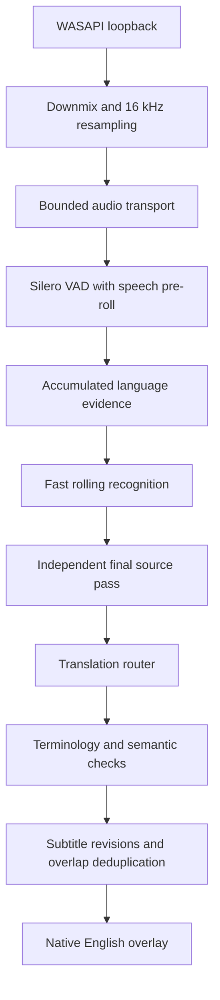

# LiveSub architecture

## Product boundary

LiveSub is a Windows x64 desktop application. A native Rust process owns system-audio capture, lifecycle, bounded transport, UI state, diagnostics, hotkeys, and the overlay. One persistent local Python worker owns VAD, language evidence, speech recognition, optional text translation, and translation-quality processing.

The application does not integrate with individual media sites. It captures the active Windows render endpoint with shared-mode WASAPI loopback, so normal system-audio translation does not use a microphone or require a browser extension.

## High-level pipeline

## Native application

The Rust application uses eframe/egui for the control window. The subtitle surface is a dedicated Win32 layered window because renderer-owned transparent viewports did not compose reliably during Windows testing. The overlay uses premultiplied BGRA with `UpdateLayeredWindow`, topmost/tool-window/no-activate flags, optional click-through, native dragging, and monitor placement.

`AudioCaptureBackend` owns endpoint enumeration and capture lifecycle. The Windows implementation follows the default render endpoint, performs loopback capture, and exposes recovery/drop metrics. `AudioNormalizer` performs stateful channel downmix and resampling to 16 kHz mono float audio; it rejects an unexpected midstream format mutation rather than feeding corrupted samples downstream.

`SubtitleAssembler` is the only component allowed to turn hypotheses into display state. It rejects stale revisions, holds disruptive partial rewrites until final, removes overlap against recent text, keeps bounded session history, and produces one or two semantic display lines. The overlay never receives raw decoder output.

## Process boundary and queues

Rust and Python communicate through versioned NDJSON over redirected standard input/output. Audio is encoded as 16 kHz mono signed-16 PCM. Standard error is diagnostics-only so log output cannot corrupt the protocol.

Capture never blocks on VAD, ASR, translation, or UI. The native capture channel holds 16 frames, the Rust-to-worker command channel 24 messages, worker audio 32 chunks, and the latest-ASR queue two jobs. Superseded partial jobs are coalesced; drops and queue depth are reported. Speech windows are capped so continuous audio or a bad VAD boundary cannot create unlimited finalization latency.

The worker loads once and warms the selected inference backend before WASAPI capture starts. This prevents model startup from creating an audio backlog. In AUTO mode, the bundled path accepts CUDA/float16 only after smoke decodes and otherwise falls back to CPU/int8.

## VAD and language identification

The worker runs stateful Silero VAD and preserves roughly 400 ms of pre-roll so quiet sentence starts are less likely to be cut. VAD is treated as an accuracy stage: silence, music, and noise sent to ASR can create hallucinations, while overly aggressive boundaries can delete speech.

Language identification borrows bounded recent final audio when the current fragment is short. Evidence is accumulated with confidence, duration, hit counts, decay, and hysteresis. A high-confidence sample with sufficient audio can lock quickly; switching a stable language requires repeated contradictory evidence and a score margin. Sustained silence clears the language lock, source context, glossary, and translation memory so a new media source does not inherit stale context.

## Recognition and translation

The ASR layer has provider-neutral concepts for capabilities, language detection, streaming transcription, final transcription, confidence, and timestamps. The repository currently provides faster-whisper and Qwen3 candidate adapters; the packaged Preview uses the faster-whisper-compatible `small` model. A candidate adapter does not imply its weights ship.

Rolling partial recognition keeps the display responsive. At a speech boundary, LiveSub runs an independent final source-language transcription with bounded same-language context. English uses transcription; non-English output can use direct speech-to-English translation or a configured source-text translator. Current production selection has not yet been determined separately for Russian, Japanese, and Hindi from a complete human-reviewed benchmark matrix.

The translation layer includes:

- a language-specific router and specialist text-translator interface;
- a curated terminology engine;
- a session glossary that requires repetition/confidence before locking a proper noun;
- context-aware translation memory;
- semantic checks for negation, numbers, directions, time, currency, percentages, and terminology;
- a bounded verification retry for critical/high issues;
- quality metadata that records which candidate was selected and the extra inference time.

The system preserves source text, English output, language, timestamps, confidence, model/engine labels, and quality metadata in the active session. It does not persist captured audio or transcript history to disk in normal operation.

## Subtitle stability

Partials update the same segment/revision instead of appending a staircase. Extension-like refinements may update in place; unrelated large rewrites are held until final. VAD end triggers immediate finalization. Final text is reconciled against recent overlapping output, and repetition/no-speech/low-confidence guards can suppress likely decoder loops or hallucinations.

Normal users primarily see confirmed text. Optional bilingual mode places the source-language final transcript above English. The overlay constrains display to readable semantic lines without arbitrarily truncating source meaning.

## Recovery and portability

AUTO mode tracks the Windows default render endpoint. Device invalidation or a default-ID change tears down the active WASAPI session and retries with bounded exponential backoff. Explicit endpoint selection surfaces failure rather than silently switching.

Capture and AI process boundaries can support future platform backends, but the current implementation and installer are Windows-only. Exclusive fullscreen, secure desktops, protected surfaces, and some anti-cheat environments can prevent the native overlay from composing; LiveSub does not bypass those protections.

## Language Packs and supply chain

The repository includes Language Pack and signed-registry schemas. A future production pack will pin model owners, repositories, revisions, files, hashes, licenses, runtime recipes, hardware profiles, and benchmark evidence. Candidate downloads are explicit, staged into a temporary directory, checked for disk space and expected files, hashed, and recorded with provenance before promotion.

The consumer runtime does not enable arbitrary remote code and does not search the public internet for random models. Registry entries remain development candidates until license, provenance, accuracy, latency, and integrity review passes. The consumer install/update/rollback UI and signed production registry are not complete.

## Current architecture risks

1. The bundled `small` model is a working Preview route, not an evidence-selected final route for every default language.
2. Human-approved corpora and full per-language WER/CER/translation matrices are incomplete.
3. CPU fallback exists, but broad CPU/GPU/driver performance guidance is not certified.
4. Long-duration per-language and controlled device-switch acceptance remain open.
5. The self-contained installer is large, unsigned, and awaiting source/bundled-component redistribution review.
